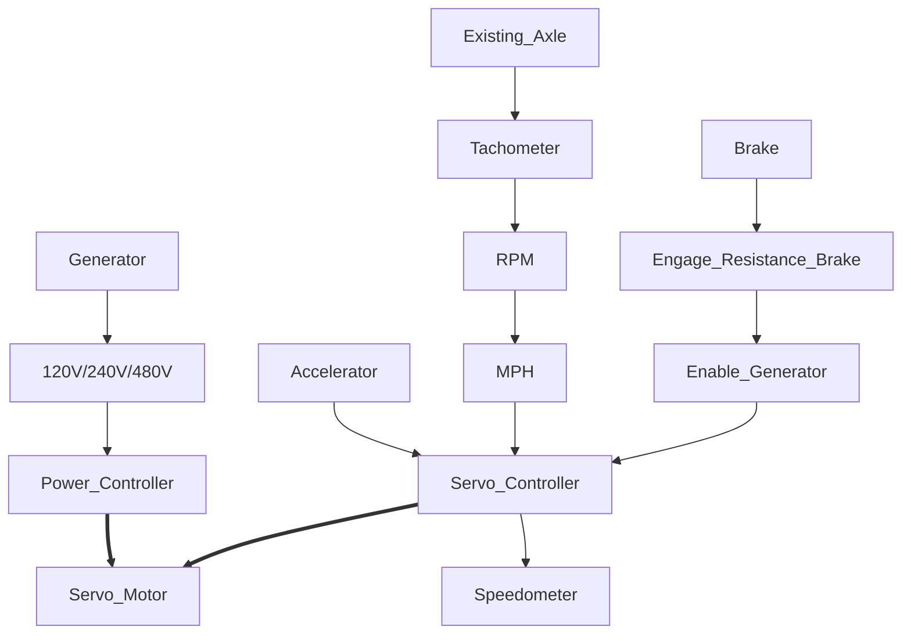

# Linear-Hybrid-Conversion
Convert a traditional gas vehicle to a generator servo driven hybrid.

This repo is aimed at creating a set of parameters for removing a traditional engine and replacing it with a generator and servo with a ujoint adapter driving an existing axle.

PLC used to drive a servo.

PLC reads existing tachometer on axles or other methods used to determine speed.

Convert current accelerator outputs to "accelerate" "idle" "decelerate"

Convert brake to a resistor load, potentially convert the servo brake to a generator to feedback energy to a battery bank.

With a more efficient generator does a battery bank even need to exist? Yes it would increase waste energy however reducing initial cost by removing batteries.

Steepest incline in United States ~45% (Hawaii)

Heaviest non - commercial vehicle HUMMER EV > 9000 lbs

## Calculations
Assuming weight of 10000 lbs (4535.924 kg) , will be working 4500 kg (9920.802 lbs) for duration 

F_needed = F_parallel + F_friction

F_parallel = mg * sin(theta)

F_friction = mu * F_normal

F_normal = mg * cos(theta)

